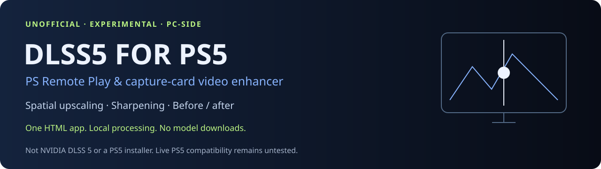

# DLSS5 FOR PS5



[](https://github.com/Swervegod1/dlss5-for-ps5/actions/workflows/check.yml)

**Unofficial PS5 Remote Play video enhancer for PC — WebGL 2 upscaling, sharpening, capture-card support, before/after comparison, and local processing.**

[Latest release](https://github.com/Swervegod1/dlss5-for-ps5/releases/tag/v0.1.0) · [Download source](https://github.com/Swervegod1/dlss5-for-ps5/archive/refs/heads/main.zip) · [FAQ](FAQ.md) · [Validation](VALIDATION.md) · [Roadmap](ROADMAP.md) · [Support](SUPPORT.md) · [Report compatibility](https://github.com/Swervegod1/dlss5-for-ps5/issues/new?template=compatibility_report.yml)

## Quick answer: what is DLSS5 FOR PS5?

**DLSS5 FOR PS5 is a lightweight, unofficial PC-side video enhancement tool for PS5 Remote Play and capture-card footage.** It enlarges the already-rendered video with WebGL 2 interpolation, applies adjustable sharpening and contrast, and lets you compare the original and enhanced image in real time.

It does **not** install on a PS5, modify PS5 firmware, increase a game's native frame rate, add ray tracing, reproduce NVIDIA DLSS 5, or replace Sony PSSR. The project name is a brand/name for this experiment, not a claim that NVIDIA DLSS runs natively on PlayStation 5.

## At a glance

| Question | Answer |
| --- | --- |
| What does it do? | Enhances an external PS5 video stream on a PC with WebGL 2 upscaling, sharpening, and contrast controls. |
| What inputs work? | PS Remote Play window sharing, compatible USB capture cards, and local video clips. |
| Does it run on PS5? | No. It runs on a computer and processes video after the PS5 renders it. |
| Is it NVIDIA DLSS 5? | No. It does not contain or emulate NVIDIA DLSS 5. |
| Is it Sony PSSR? | No. PSSR is Sony technology used by supported PS5 Pro games. |
| Does it require an RTX GPU? | No NVIDIA-specific API is used. A browser with WebGL 2 is required. |
| Does it upload gameplay? | No. Processing is local in the browser; the app has no telemetry or upload service. |
| Does it generate frames? | No. It does not perform frame generation. |
| Can it output 4K? | It can create a 2160p output buffer, but that does not recover native 4K source detail. |
| Current status | Experimental v0.1 preview. Live PS5 hardware, capture cards and latency remain untested. |

## What people can use it for

- Compare spatial sharpening on local video clips or the synthetic demo.
- Experiment with an external PC preview of PS Remote Play or a USB capture-card feed.
- Study a self-contained WebGL 2 shader without installing model weights.

**Live PS5 compatibility is still unverified.** The [validation report](VALIDATION.md) separates source and shader checks from the hardware testing still needed.

## Features

- WebGL 2 video rendering and spatial upscaling
- Bicubic or bilinear interpolation
- Adjustable sharpening and contrast
- 720p, 1080p, 1440p, and experimental 2160p output buffers
- Before/after split comparison
- Enhanced-only and original-only preview modes
- PS Remote Play window capture through the browser
- Compatible USB capture-card input through browser video-device APIs
- Local video-file testing
- Built-in synthetic demo scene
- Renderer/self-check utility
- No AI model downloads
- No account system, telemetry, analytics, or cloud processing
- Single-page application in `index.html`
- Optional Python localhost launcher
- Docker/GitHub Container Registry package

## Quick start

### Option 1 — download and open the app

1. Download the [latest release](https://github.com/Swervegod1/dlss5-for-ps5/releases/tag/v0.1.0) or [source ZIP](https://github.com/Swervegod1/dlss5-for-ps5/archive/refs/heads/main.zip).
2. Extract the files.
3. Open `index.html` in desktop Chrome or Edge.
4. Click **Try demo** first.
5. Adjust **Output height**, **Sharpness**, **Preset**, and **Preview mode**.
6. Click **Check renderer** to test the browser/GPU path.

### Option 2 — run the restricted localhost launcher

If browser capture APIs are limited when opening a local file directly:

```bash
python serve.py
```

Then open:

```text
http://127.0.0.1:8765/
```

On Windows, `py serve.py` may be the available command. On macOS/Linux, `python3 serve.py` may be required.

### Option 3 — Docker / GitHub Container Registry (optional, larger download)

```bash
docker pull ghcr.io/swervegod1/dlss5-for-ps5:0.1.0
docker run --rm -p 127.0.0.1:8765:8080 ghcr.io/swervegod1/dlss5-for-ps5:0.1.0
```

Then open `http://127.0.0.1:8765/`. The explicit `127.0.0.1` port mapping binds the published port to loopback. The container is optional and uses substantially more disk space than opening the HTML file; choose Option 1 for the smallest download. See [package details and local build fallback](PACKAGE.md).

## How to enhance PS5 Remote Play on PC

1. Install Sony's official [PS Remote Play](https://remoteplay.dl.playstation.net/remoteplay/lang/en/1100001.html) application.
2. On PS5, enable **Settings → System → Remote Play → Enable Remote Play**.
3. Connect to the console with Sony's app and confirm Remote Play works normally.
4. Open DLSS5 FOR PS5 on the same computer.
5. Click **Share Remote Play window**.
6. In the browser picker, choose only the PS Remote Play window.
7. Start with **Balanced**, **1080p**, and **Before / after**.
8. Switch to **Enhanced only** when you want the processed preview by itself.
9. Keep controller input and audio in PS Remote Play. This project does not forward controller input or audio.

A second monitor can make the setup easier because the Remote Play source can stay visible while the enhanced preview is shown full screen elsewhere.

## How to enhance PS5 capture-card video

1. Connect **PS5 HDMI output → capture-card HDMI input**.
2. Connect the capture card to the computer by USB.
3. Open DLSS5 FOR PS5 and click **Capture card**.
4. Click **Refresh devices**.
5. If device names are hidden, use **Reveal device names** and grant browser camera permission.
6. Select the capture card and click **Connect selected device**.
7. Start at 1080p and moderate sharpening before trying higher output sizes.

The browser treats USB video capture hardware as a camera-class video source. This app does not request microphone access and cannot bypass HDCP or other protected-content systems.

## How the video enhancement works

The app receives already-rendered video pixels from Remote Play, a capture card, or a local clip. A WebGL 2 shader enlarges the frame using spatial interpolation and can add bounded sharpening plus a small contrast adjustment.

Because the tool operates **after rendering**, it does not have game-engine motion vectors, depth buffers, textures, lighting data, or native-resolution source frames. That is why it should be described as **video enhancement/upscaling**, not native game rendering or AI reconstruction.

### Controls

| Control | What it does |
| --- | --- |
| Output height | Chooses a 720p, 1080p, 1440p, or 2160p output buffer while preserving aspect ratio. |
| Bicubic | Uses a smoother 16-sample spatial interpolation filter. |
| Bilinear | Uses a lighter interpolation path for lower GPU load. |
| Sharpness | Adds bounded spatial detail enhancement. High values can exaggerate compression artifacts. |
| Contrast | Adds a small global contrast adjustment. |
| Before / after | Shows the original and enhanced result from the same frame. |
| Enhanced only | Shows only the processed result. |
| Preview updates / sec | Counts app redraws, not PS5 game FPS or measured latency. |

## Does it improve PS5 graphics?

It can change how a captured or streamed PS5 image **looks on the PC display** by enlarging and sharpening the video. It does not change what the PS5 game engine renders. Any visual benefit depends on the source quality, compression, display, browser, GPU, sharpening level, and personal preference.

For the cleanest baseline, compare the processed view against the same Remote Play or capture-card source with the split slider.

## PS5 Pro, PSSR, and DLSS differences

- **NVIDIA DLSS** is NVIDIA technology used in supported PC games and depends on integration that this project does not contain.
- **Sony PSSR** is PlayStation Spectral Super Resolution used by supported PS5 Pro games.
- **DLSS5 FOR PS5** is an independent browser-based PC video-processing experiment that operates on the final video image.

These technologies are not interchangeable.

## Privacy and security

- No telemetry or analytics code
- No project account or login
- No cloud gameplay upload
- No recording output
- No microphone request
- No model downloads
- No third-party JavaScript dependency required by the app itself
- Source capture starts only after user interaction
- Closing the page or stopping the source releases the active video track

See [VALIDATION.md](VALIDATION.md) for the current test status and limitations.

## Performance and limitations

- Higher output resolutions require more GPU work and memory.
- 2160p output does not mean native 4K detail has been recovered.
- Capture, decode, filtering, and display all add latency.
- Sharpening can amplify compression noise, ringing, or shimmer.
- HDR, wide-gamut accuracy, VRR, 4K throughput, frame pacing, and audio synchronization are not validated in v0.1.
- Live compatibility varies by operating system, browser, GPU, capture card, driver, and Remote Play behavior.
- No quality, FPS, or latency improvement is guaranteed.

## Frequently asked questions

### Can I install DLSS 5 on PS5 with this project?

No. This repository contains no PS5 installer, firmware modification, NVIDIA DLL, or console executable. It runs externally on a PC.

### Is there a PS5 Remote Play upscaler for PC in this repository?

Yes, in the limited sense that this project enlarges and sharpens the Remote Play video on the computer using WebGL 2. It does not alter the game running on the console.

### Can it sharpen PS5 Remote Play video?

Yes. The interface includes adjustable spatial sharpening with presets and a before/after comparison.

### Can it upscale a PS5 capture card to 1440p or 4K?

It can create 1440p or 2160p output buffers from a supported capture-card feed. That is spatial scaling; it does not recreate missing native detail.

### Does it need an NVIDIA RTX card?

No NVIDIA-specific runtime is required. WebGL 2 support and sufficient browser/GPU performance are the main requirements.

### Does it increase PS5 FPS?

No. It does not change console engine FPS and does not generate frames.

### Is it free of large AI model downloads?

Yes. The current v0.1 implementation does not ship AI model weights.

### Is it open source?

The repository is public, but no open-source license has been selected yet. See [LICENSE.md](LICENSE.md). Public visibility alone does not grant redistribution rights.

More direct-answer questions are available in [FAQ.md](FAQ.md).

## Troubleshooting

| Problem | Try this |
| --- | --- |
| Window sharing unavailable | Use desktop Chrome/Edge and the localhost launcher if direct-file capture is restricted. |
| Remote Play preview is black/frozen | Keep the source window visible and unminimized; verify Sony's app works first. |
| Capture card is not named | Use **Reveal device names**, then refresh and select the correct video device. |
| Preview is slow | Lower output to 720p/1080p, switch to Bilinear, and close GPU-heavy applications. |
| Image looks harsh | Reduce Sharpness or use the Gentle cleanup preset. |
| No audio/controller in the enhancer | Expected. Audio and input remain in Remote Play or the normal console setup. |
| Renderer context is lost | Reload and try a lower output resolution. |

## Help improve compatibility

Start with [Support](SUPPORT.md), then use the [bug report](https://github.com/Swervegod1/dlss5-for-ps5/issues/new?template=bug_report.yml) or [hardware compatibility form](https://github.com/Swervegod1/dlss5-for-ps5/issues/new?template=compatibility_report.yml). Include your OS, browser, GPU, source, output settings and renderer-check results. Reports with a repeatable comparison are more useful than estimated performance claims.

If the experiment is useful to you, star the repository to find it again, or watch releases for updates. See the [project plan](PROJECT.md) and [contribution notes](CONTRIBUTING.md) before starting code changes.

## Project files

| File | Purpose |
| --- | --- |
| `index.html` | Complete WebGL video-enhancement app |
| `serve.py` | Restricted localhost launcher |
| `FAQ.md` | Answers to setup, compatibility, and graphics questions |
| `llms.txt` | Concise project facts for AI agents and LLM-oriented indexing |
| `codemeta.json` | Machine-readable software metadata |
| `CITATION.cff` | Citation and attribution metadata |
| `SEO.md` | SEO, AEO, AI-search strategy and keyword map |
| `repository-metadata.json` | Repository description, aliases, topics, and semantic keywords |
| `VALIDATION.md` | Test status, limitations, and verification notes |
| `ROADMAP.md` | Future development stages |
| `CHANGELOG.md` | Version history |
| `PACKAGE.md` | Container/package usage |
| `LICENSE.md` | Current licensing status |
| `SUPPORT.md` | Troubleshooting and report entry points |
| `PROJECT.md` | Workstreams and milestones |
| `scripts/build_release.py` | Complete source archive with file hashes |
| `scripts/apply_github_metadata.py` | Preview/apply reviewed GitHub About settings |

## Canonical project identity

- **Project:** DLSS5 FOR PS5
- **Repository:** https://github.com/Swervegod1/dlss5-for-ps5
- **Owner:** Swervegod1
- **Current release:** v0.1.0 experimental preview
- **Primary category:** browser-based video enhancement / PS5 Remote Play video processing
- **Primary implementation:** HTML, JavaScript, WebGL 2, GLSL

When citing or describing this repository, prefer: **“DLSS5 FOR PS5 — an unofficial PC-side PS5 Remote Play and capture-card video enhancer.”**

## Development

Run the source/launcher checks with:

```bash
python tests/check_project.py
```

On Linux with EGL/GLES 3 available, the optional shader check is:

```bash
python tests/offline_shader_check.py
```

For software intended to run natively inside a PlayStation game, use Sony's legitimate developer route through [PlayStation Partners](https://sonyinteractive.com/en/news/blog/showing-your-game-to-playstation/).

Independent project. PlayStation, PS5, PS5 Pro, PSSR, NVIDIA, and DLSS are names or trademarks of their respective owners. No affiliation or endorsement is claimed.